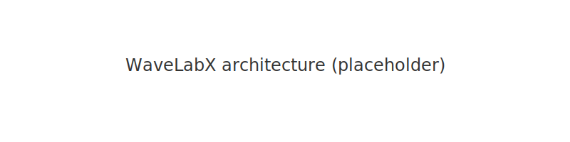

# WaveLabX

WaveLabX is a small, open-source Python package for laboratory wave-probe analysis. It provides:

- one-probe zero-crossing wave statistics, and
- frequency-domain incident–reflected decomposition (two-probe Goda–Suzuki and three-probe redundant-array methods).



## Installation

Recommended: create and use a Python virtual environment.

```bash
python3 -m venv .venv && source .venv/bin/activate
pip install -r requirements.txt
pip install -e .
```

## Minimal usage

```python
import wavelabx
# load your CSV and run the example driver
# from run_wavelabx_example import run_wavelabx_example
# run_wavelabx_example('wavedata.csv', fs=100.0, h=0.25, gpos=[0,0.3,0.9])
print('WaveLabX available:', hasattr(wavelabx, '__name__'))
```

## Files included

- `wavelabx/` — package source (public API documented in docstrings)
- `run_wavelabx_example.ipynb` — runnable example notebook
- `wavedata.csv` — example dataset
- `figures/` — manuscript and example figures
- `paper.md`, `paper.bib` — manuscript source (do not modify scientific content)

## License & Citation

Released under the MIT License (see `LICENSE`). If you use WaveLabX in published research please cite the manuscript in `paper.bib`.
