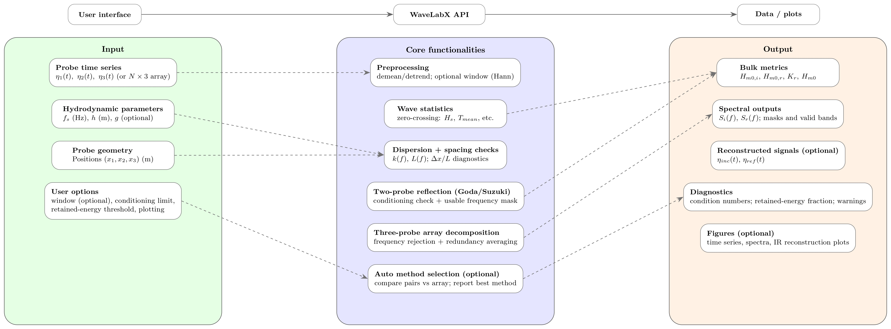

# WaveLabX

[](https://doi.org/10.5281/zenodo.18049227)

WaveLabX is an open-source Python toolkit for laboratory wave-probe analysis, providing reproducible wave statistics and incident–reflected decomposition.

- Zero-crossing wave statistics from single-probe records
- Two-probe Goda–Suzuki frequency-domain decomposition
- Three-probe redundant-array decomposition with validity filtering



## Installation

Recommended: use a Python virtual environment.

```bash
python3 -m venv .venv
source .venv/bin/activate
pip install -e .
```

## Minimal usage

```python
import wavelabx
# See run_wavelabx_example.ipynb for a full demonstration
```

## Browser tool

**Live demo: [wave-lab-x.vercel.app](https://wave-lab-x.vercel.app)**

`web/` contains a self-contained browser application for three-probe
reflection analysis. Drop one or more 6-channel wave-gauge CSV files to
get a table of incident/reflected wave heights and reflection
coefficients for two probe arrays, plus interactive visualization —
time-series, energy-spectrum and power-spectrum plots with zoom, pan,
and per-point readouts. It runs entirely client-side (no install, no
server).

To run it locally, open `web/index.html`, or serve the folder:

```bash
cd web && python3 -m http.server 8000
```

## Files included

- `wavelabx/` — package source (API documented in docstrings)
- `web/` — browser-based reflection-analysis and visualization tool
- `run_wavelabx_example.ipynb` — example notebook
- `wavedata.csv` — example dataset
- `figures/` — figures and examples

## License

WaveLabX is released under the MIT License (see `LICENSE`).

## How to cite

If you use WaveLabX in your research, please cite the archived software release:

> Lamsal, S., & Rhode-Barbarigos, L. (2025). *WaveLabX* (v0.1.0) [Software]. Zenodo. [https://doi.org/10.5281/zenodo.18049227](https://doi.org/10.5281/zenodo.18049227)

BibTeX:

```bibtex
@software{wavelabx,
  author    = {Lamsal, Sandesh and Rhode-Barbarigos, Landolf},
  title     = {WaveLabX},
  version   = {0.1.0},
  year      = {2025},
  doi       = {10.5281/zenodo.18049227},
  url       = {https://github.com/sandslamsal/WaveLabX},
  publisher = {Zenodo}
}
```

Citation metadata is also provided in `CITATION.cff`.
