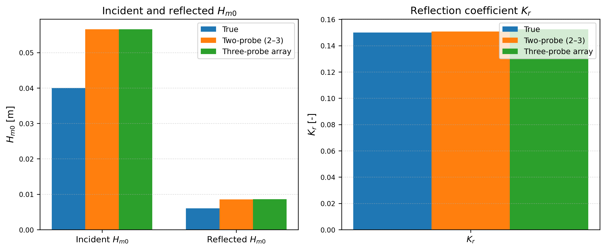

## Summary

Wave-probe time series collected in wave flumes and basins are widely used to compute wave statistics (e.g., significant wave height and characteristic periods) and to estimate incident and reflected wave components for reflection analysis. Although the underlying methods are well established, their practical implementation is often fragmented across laboratories in the form of facility-specific scripts, limiting reproducibility, transparency, and cross-study comparison.

WaveLabX is an open-source Python package that provides a unified and reproducible workflow for (1) zero-crossing wave statistics from single-probe records and (2) frequency-domain incident–reflected decomposition using either the classical two-probe Goda–Suzuki method or a redundant three-probe array method. The package integrates automated probe-spacing checks, numerical-conditioning diagnostics, and optional visualization tools to support quality control and interpretation.

The software is designed for use in laboratory experiments and research-oriented workflows, with an emphasis on clarity, diagnostic transparency, and reproducibility.

Repository: <https://github.com/sandslamsal/WaveLabX>.

## Statement of need

Wave reflection analysis is highly sensitive to probe spacing and can yield unreliable results when probe configurations become ill-conditioned, even when nominal spacing guidelines are satisfied. In many existing implementations, such failures occur silently, making it difficult for users to assess the validity of computed incident and reflected components.

Researchers and practitioners therefore require tools that are not only methodologically correct, but that also expose diagnostic information related to spacing validity, numerical conditioning, and spectral retention. Such diagnostics are essential for interpreting results, comparing experiments, and ensuring reproducible analysis.

WaveLabX addresses this need by:
- providing a readable, open-source reference implementation of common wave-probe analysis workflows;
- standardizing preprocessing, spectral estimation, and decomposition steps across methods;
- reporting diagnostic indicators (e.g., matrix condition numbers and retained-energy fractions) that guide method selection and result interpretation.

## Functionality

WaveLabX provides three core capabilities:

1. **Zero-crossing wave statistics**  
   Wave-by-wave reconstruction from a single probe time series, returning bulk statistics (e.g., significant wave height and mean period) as well as wave-by-wave height and period arrays.

2. **Two-probe reflection decomposition (Goda–Suzuki)**  
   Frequency-domain estimation of incident and reflected spectra and bulk metrics (e.g., $H_{m0,i}$, $H_{m0,r}$, and reflection coefficient $K_r$), with automated probe-spacing validation and numerical-conditioning checks.

3. **Three-probe redundant array decomposition**  
   Redundant pairing of probes with validity filtering and averaging to obtain stable incident and reflected estimates when individual probe pairs are unfavorable or ill-conditioned.

The package includes example scripts and datasets that demonstrate typical usage scenarios and highlight the impact of probe spacing and numerical conditioning on reflection estimates.

The following example figure illustrates a representative validation against a synthetic benchmark, showing recovered incident and reflected quantities:

## Illustrative example

WaveLabX includes an illustrative dataset and analysis scripts showing how probe spacing and numerical conditioning can significantly affect two-probe reflection results, and how redundant three-probe estimation can provide more stable outcomes. The example demonstrates the recovery of incident and reflected spectra after validity filtering and redundant averaging.

## Availability and reuse

WaveLabX is released under the MIT License and is intended to be easy to install and integrate into laboratory processing pipelines and Jupyter-based workflows. The repository includes example datasets, scripts to reproduce validation figures, and documentation describing common usage patterns.

The software is designed to be extensible, allowing users to incorporate additional wave-processing routines or adapt the workflows to facility-specific needs.

## Acknowledgements

WaveLabX was developed based on experimental workflows used in the SUSTAIN Laboratory at the University of Miami. The authors acknowledge colleagues and technical staff who supported the experimental programs that motivated the development of this software.

## References
