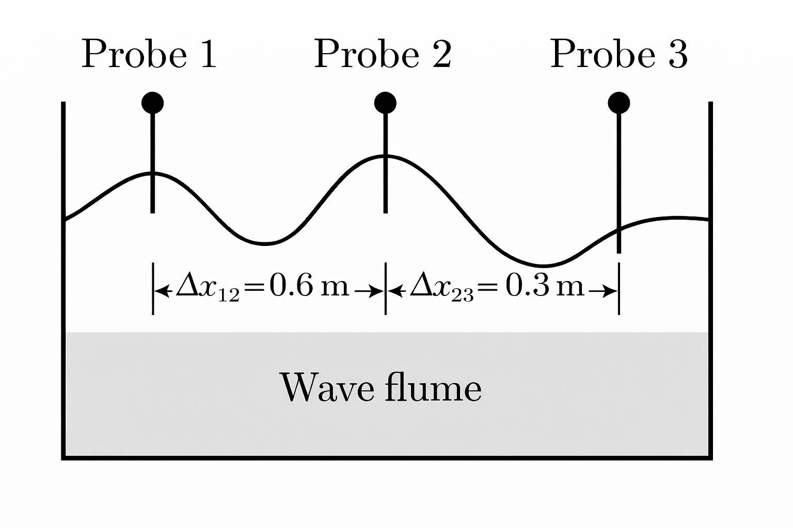
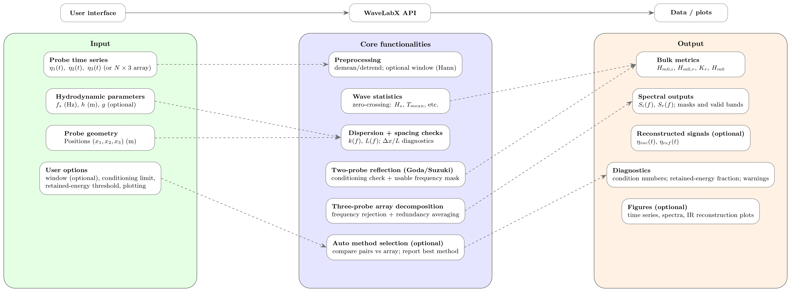
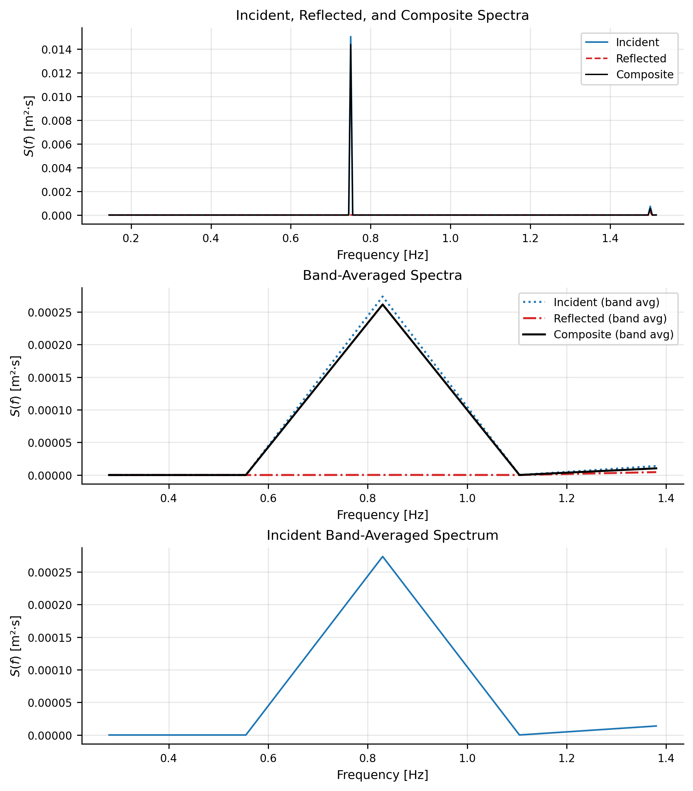

## Summary

WaveLabX is an open-source Python toolkit for processing laboratory wave-probe time series in coastal and hydraulic engineering. It provides a unified and reproducible workflow for zero-crossing wave statistics and frequency-domain incident–reflected decomposition using either the classical two-probe Goda–Suzuki method or a redundant three-probe array formulation. The software integrates standardized preprocessing, probe-spacing checks, numerical-conditioning diagnostics, and spectral integration to support reliable reflection analysis in wave flumes and basins.

WaveLabX consolidates analysis methods that are widely used but often implemented as facility-specific scripts, improving transparency, reproducibility, and cross-study comparability.

## Statement of need

Wave-probe measurements are central to physical modeling of wave–structure interaction, where wave heights, spectra, and reflection coefficients are required to assess coastal protection systems, breakwaters, and experimental wave conditions. Although zero-crossing statistics and the Goda–Suzuki reflection method are well established, their implementations are frequently fragmented across laboratories, limiting reproducibility and long-term preservation of experimental workflows.

A critical limitation of classical reflection analysis is its sensitivity to probe spacing and numerical conditioning. Even when nominal spacing guidelines are satisfied, certain probe configurations can produce ill-conditioned inversions and physically inconsistent results. These issues often remain undetected in existing implementations.

WaveLabX addresses this need by providing a transparent reference implementation that embeds spacing diagnostics, conditioning checks, and retained-energy metrics directly into the analysis, allowing users to assess result reliability alongside computed wave quantities.

## Methodological background

The reflection-analysis methods implemented in WaveLabX rely on measurements from multiple wave probes aligned along the direction of wave propagation. A typical three-probe configuration used by the software is illustrated in Figure 1.

### Linear wave theory and dispersion

WaveLabX assumes linear wave theory to describe free-surface elevation as a superposition of incident and reflected wave components. The frequency-dependent wavenumber \(k\) is obtained from the linear dispersion relation
$$
\omega^2 = gk \tanh(kh),
$$
where \(\omega = 2\pi f\), \(h\) is the still-water depth, and \(g\) is gravitational acceleration. This relation is solved iteratively for each frequency and is used consistently across all reflection algorithms.

### Two-probe incident–reflected decomposition

For two probes located at positions \(x_1\) and \(x_2\), the free surface is modeled as
$$
\eta(x,t)
= a_i \cos(\omega t - kx)
+ a_r \cos(\omega t + kx),
$$
where \(a_i\) and \(a_r\) are the incident and reflected amplitudes. Fourier coefficients from the two probes are used to solve for frequency-dependent incident and reflected spectra following the formulation of Goda and Suzuki [@goda1976incident].

Integrated spectral wave heights are computed as
$$
H_{m0} = 4\sqrt{\int S(f)\,df},
$$
with the reflection coefficient defined as
$$
K_r = \frac{H_{m0,r}}{H_{m0,i}}.
$$

Classical guidance recommends a non-dimensional probe spacing
$$
0.05 \le \frac{\Delta x}{L} \le 0.45,
$$
where \(L\) is the linear wavelength associated with the dominant period. WaveLabX evaluates this criterion and additionally reports the numerical conditioning of the inversion to identify frequencies where the solution becomes unreliable.

### Three-probe redundant array method

With three probes at \((x_1, x_2, x_3)\), WaveLabX forms three independent probe pairs. For each frequency, incident and reflected solutions are computed for all pairs, frequencies violating wavelength or conditioning constraints are discarded, and consistent solutions are averaged. If \(\mathcal{V}(f)\) denotes the set of valid probe pairs at frequency \(f\), the reconstructed amplitudes are
$$
\hat{a}_i(f)
= \frac{1}{|\mathcal{V}(f)|}
\sum_{(i,j)\in\mathcal{V}(f)} a_i^{(i,j)}(f),
\qquad
\hat{a}_r(f)
= \frac{1}{|\mathcal{V}(f)|}
\sum_{(i,j)\in\mathcal{V}(f)} a_r^{(i,j)}(f).
$$

This redundant formulation improves robustness relative to the two-probe method, particularly when one probe pair is unfavorably spaced or poorly conditioned.

The overall workflow and software architecture are shown in Figure 1.

An example three-probe decomposition output is shown in Figure 2.

## Usage

WaveLabX is designed for use in Python scripts and Jupyter notebooks. Users provide wave-probe time series, sampling frequency, water depth, and probe positions. Core functions return bulk wave metrics, frequency-dependent spectra, and diagnostic information. Optional plotting routines generate publication-quality figures of spectra and reconstructed incident and reflected time series.

## Applications and scope

WaveLabX has been applied to laboratory studies of wave–structure interaction, including submerged breakwaters and modular reef systems. Typical applications include reflection-coefficient estimation, comparison of alternative probe layouts, and quality-controlled post-processing of experimental datasets.

The software is intended for one-dimensional wave propagation with collinear probe arrangements and linear-wave behavior.

## Limitations

WaveLabX assumes collinear probe geometry aligned with the dominant wave direction and relies on linear dispersion. Strongly nonlinear waves, breaking, or multi-directional wave fields are outside the intended scope. Portions of the spectrum may be rejected due to unfavorable spacing or poor conditioning; when the retained-energy fraction is low, the resulting estimates may be unreliable.

## Availability

WaveLabX is available at <https://github.com/sandslamsal/WaveLabX>.  
The software runs on Windows, macOS, and Linux with Python ≥ 3.9 and is released under the MIT License.  
A citable archive is available via Zenodo (DOI: 10.5281/zenodo.18049227).

## Acknowledgements

The development of WaveLabX was motivated by experimental workflows used in the SUSTAIN Laboratory at the University of Miami. The authors thank colleagues and technical staff who supported the laboratory programs that informed the design of this software.

## References
