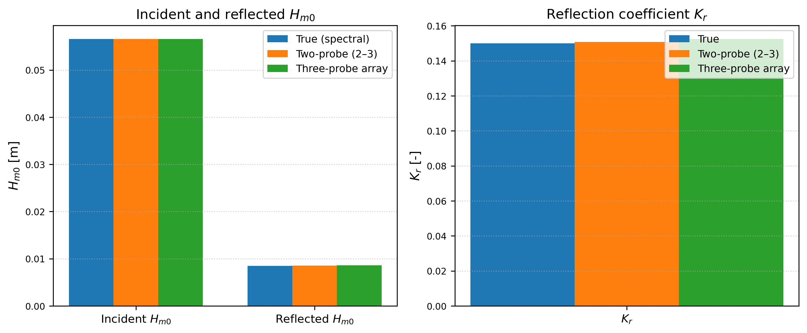
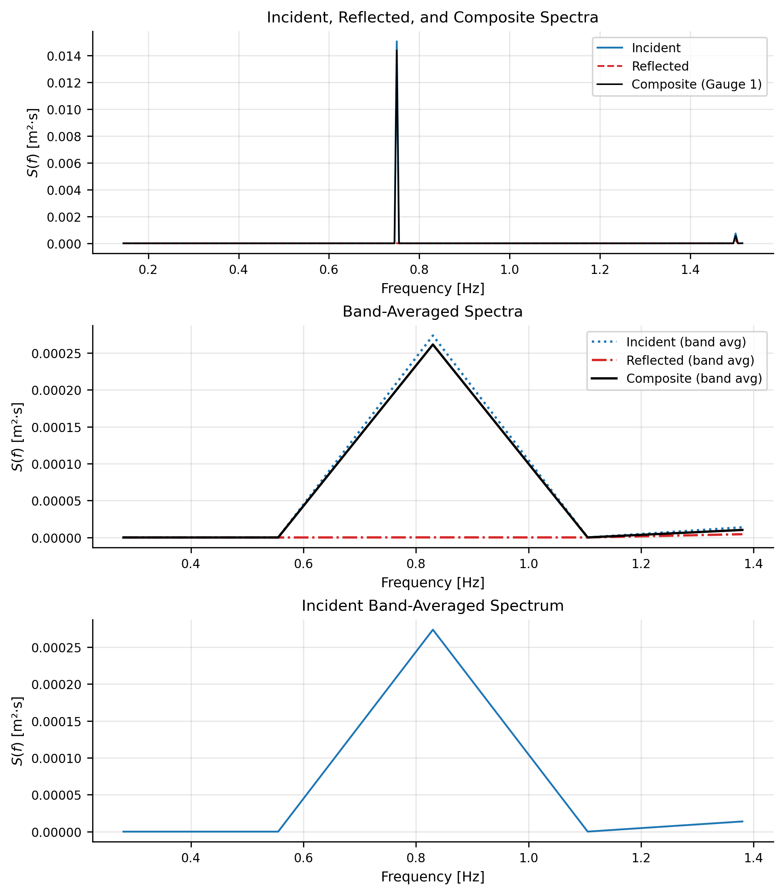

## Summary

Wave-probe time series measured in wave flumes and basins are routinely used to compute wave statistics (e.g., significant wave height and characteristic periods) and to estimate the incident and reflected components needed for reflection analysis. While the underlying methods are well established, practical implementations often remain fragmented across laboratories as facility-specific scripts, which limits reproducibility and makes it difficult to compare results across experiments.

WaveLabX is an open-source Python package that provides a unified, reproducible workflow for (1) one-gauge zero-crossing wave statistics and (2) frequency-domain incident–reflected decomposition using either the classical two-probe Goda–Suzuki method or a redundant three-probe array method. The package includes automated probe-spacing checks and numerical-conditioning diagnostics to help users identify unreliable configurations, alongside optional plotting to support quality control and interpretation.

Repository: <https://github.com/sandslamsal/WaveLabX>.

## Statement of need

Reflection analysis is sensitive to probe spacing and can fail silently when two-probe configurations become ill-conditioned, even when spacing appears to satisfy guideline ranges. Researchers and practitioners therefore need tooling that is not only implementationally correct, but also provides transparent diagnostics about spacing validity, numerical conditioning, and spectral retention.

WaveLabX addresses this need by:
- providing a readable, tested reference implementation of common wave-probe workflows;
- standardizing preprocessing and spectral estimation steps across methods;
- reporting diagnostic indicators (e.g., condition numbers and retained-energy fraction) that guide method selection and interpretation.

## Functionality

WaveLabX exposes three primary capabilities:

1. **Zero-crossing wave statistics**: wave-by-wave reconstruction from a single probe record, returning bulk statistics (e.g., $H_s$, mean period) and wave-by-wave arrays.

2. **Two-probe reflection decomposition (Goda–Suzuki)**: incident/reflected spectra and bulk metrics (e.g., $H_{m0,i}$, $H_{m0,r}$, $K_r$), with spacing diagnostics and conditioning checks.

3. **Three-probe redundant array decomposition**: redundant pairing, validity filtering, and averaging to obtain stable incident/reflected estimates when one probe pair is unfavorable.

The overall software architecture and data-processing workflow implemented in WaveLabX are summarized in the following figure.

The following figure illustrates a representative validation against a synthetic benchmark, showing that WaveLabX recovers prescribed incident and reflected quantities and the reflection coefficient with small error.

## Illustrative example

WaveLabX includes an illustrative dataset and scripts demonstrating how probe spacing and conditioning can strongly affect two-probe results, and how redundant three-probe estimation can remain stable. The plot below shows incident and reflected spectra from the three-probe array method after validity filtering and redundant averaging.

## Availability and reuse

WaveLabX is released under the MIT License and is intended to be easy to install and integrate into laboratory processing pipelines and Jupyter-based workflows. The repository includes example data, scripts to reproduce figures in this paper, and documentation describing typical usage patterns.

## Acknowledgements

WaveLabX was developed based on experimental workflows used in the SUSTAIN Laboratory at the University of Miami. The authors acknowledge colleagues and technical staff who supported the broader experimental program that motivated the software.

## References
